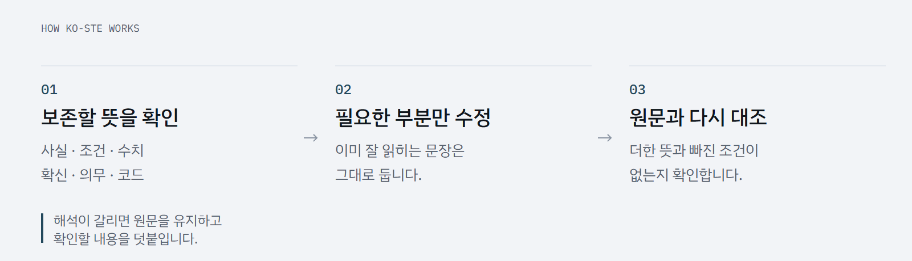

<picture>
  <source media="(prefers-color-scheme: dark) and (max-width: 600px)" srcset="assets/cover-dark-mobile.png">
  <source media="(max-width: 600px)" srcset="assets/cover-mobile.png">
  <source media="(prefers-color-scheme: dark)" srcset="assets/cover-dark.png">
  
</picture>

# ko-ste

[](LICENSE)
[](docs/install.md)
[](https://github.com/fivestar1103/ko-ste/actions/workflows/verify.yml)

**뜻은 그대로. 읽기는 쉽게.**

한국어 글을 다듬고, 직접 쓰고, 영어 기술 글을 한국어로 옮기는 Agent Skill이다. 사실·조건·수치·확신·의무의 강도를 보존하는 것을 먼저 두고, 읽기를 방해하는 부분만 고친다.

```sh
npx skills add fivestar1103/ko-ste --skill ko-ste
```

Node.js 22.20 이상과 네트워크가 필요하다. 설치 범위와 사용할 에이전트는 [skills CLI](https://github.com/vercel-labs/skills)에서 선택한다. 지침을 쓰는 데 Python이나 별도 API 키는 필요 없다. 사용하는 에이전트의 계정과 모델은 기존 설정을 따른다.

Claude Code marketplace로 설치하려면 Claude Code 안에서 실행한다.

```text
/plugin marketplace add fivestar1103/ko-ste
/plugin install ko-ste@ko-ste
```

marketplace 설치 후에는 `/ko-ste:ko-ste`로 호출한다. 직접 설치와 marketplace 중 하나를 선택한다. 사용자 전체 설치, 갱신, 선택 대조기는 [설치 안내](docs/install.md)에 있다.

## 필요한 만큼만 고친다

```text
ko-ste로 이 README를 다듬어줘.
엄격 모드로 이 설치 절차를 고쳐줘.
80% 모드로 다듬고 바꾼 이유를 표로 보여줘.
이 영어 기술 문서를 한국어로 옮겨줘.
```

| 모드 | 쓰는 곳 | 판단 기준 |
|---|---|---|
| 엄격 | 절차·설정·안내문 | 잘못 읽으면 독자가 잘못 행동하는 글 |
| 80% | 설명·보고·README·PR | 뜻이 통하는 자연스러운 설명을 과하게 고치지 않는 글 |

두 모드 모두 의미 보존을 우선한다. 문서의 설명과 설치 절차에 서로 다른 모드를 쓸 수도 있다.

| 원문 | 처리 |
|---|---|
| 배포 수행이 필요합니다. | 배포가 필요합니다. 필요를 지시로 바꾸지 않는다. |
| 모든 테스트가 통과하지 않았습니다. | 원문을 유지하고 전부 실패인지 일부 실패인지 확인한다. |
| 설정 파일은 `./config/runtime.yaml`에 저장하세요. | 이미 잘 읽히므로 그대로 둔다. 경로도 보존한다. |

기본 출력은 고친 글이다. 뜻을 정할 수 없는 부분에만 확인 메모를 붙이고, 이유를 요청하면 전후 비교와 짧은 설명을 함께 낸다.

## 원문과 다시 대조한다

<picture>
  <source media="(prefers-color-scheme: dark) and (max-width: 600px)" srcset="assets/workflow-dark-mobile.png">
  <source media="(max-width: 600px)" srcset="assets/workflow-mobile.png">
  <source media="(prefers-color-scheme: dark)" srcset="assets/workflow-dark.png">
  
</picture>

어절 수와 사전 검색 건수는 검토 신호다. 길이나 빈도만으로 문장을 바꾸지 않는다. 선택 대조기는 코드·경로·수치·표지의 차이를 찾으며, 의미 보존의 최종 판단은 문맥에서 한다.

## 확인한 것과 남은 것

자동 검사와 실제 CLI 설치, 고정 말뭉치 집계의 재현을 확인했다. 별도 입력으로 동작을 시험하고 원출력·스킬 해시·판정을 보존했다. 오류와 미판정은 통과로 세지 않는다.

기존 Claude 시험 일부는 사용 한도로 미판정이며, 개발에 쓴 사례의 점수를 현재 버전의 성과로 주장하지 않는다. 사람 독자의 이해도 향상을 측정한 실험은 하지 않았다. 공인 한국어 STE 표준이나 ASD-STE100의 번역판은 아니다.

[검증과 재현](docs/verification.md) · [측정과 한계](skills/ko-ste/references/03-calibration.md) · [배포 구조 변경 후 동작 기록](evals/distribution-2026-10-07/README.md)

## 개발

```sh
uv sync --locked
uv run python -m pytest -q
uv run python scripts/validate_artifacts.py
uv run python calibration/scripts/report.py --check
```

[기여 안내](CONTRIBUTING.md) · [변경 기록](CHANGELOG.md) · [그래픽 원본](assets/README.md)

직접 작성한 지침·문서·코드·그래픽은 [MIT](LICENSE)로 제공한다. 국립국어원 원문 예문은 별도 연구 자료로 보존하며 공공누리 제3유형을 따른다. 출처별 이용 조건은 [THIRD_PARTY.md](THIRD_PARTY.md)에 있다.
