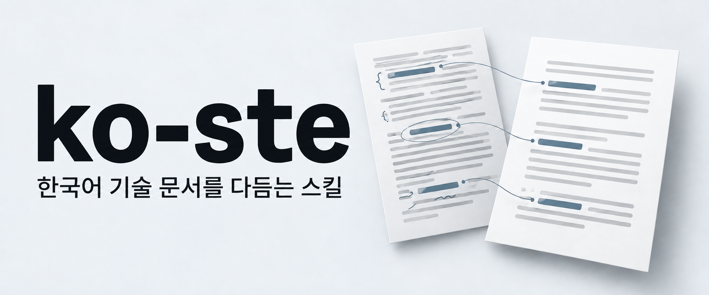

# ko-ste

한국어 기술 문서를 다듬고 쓰는 Claude Code·Codex 스킬입니다. 영어 기술 문서를 한국어로 옮길 때도 쓸 수 있습니다.

원문의 뜻을 유지하며 읽기 어려운 표현을 고칩니다.

## 설치

```sh
npx skills add fivestar1103/ko-ste --skill ko-ste
```

Node.js 22.20 이상이 필요합니다. 설치 범위와 에이전트는 실행 중에 선택합니다.

<details>
<summary>Claude Code marketplace로 설치</summary>

Claude Code 안에서 실행하세요.

```text
/plugin marketplace add fivestar1103/ko-ste
/plugin install ko-ste@ko-ste
```

설치한 뒤 `/ko-ste:ko-ste`로 호출하세요.

</details>

[전체 범위 설치·업데이트](docs/install.md)

## 사용

```text
ko-ste로 이 README를 다듬어줘.
엄격 모드로 이 설치 절차를 고쳐줘.
이 영어 기술 문서를 ko-ste로 한국어로 옮겨줘.
```

- 엄격 모드: 설치 절차·설정·안내문에 사용합니다.
- 80% 모드: README·설명·PR에 사용하며 자연스러운 표현은 과하게 고치지 않습니다.

모드를 지정하지 않으면 글의 종류에 맞춰 고릅니다.

## 예시

| 원문 | 고친 글 |
|---|---|
| 요청 처리에 실패할 경우 동일한 요청에 대한 재시도를 최대 3회까지 수행합니다. | 요청 처리에 실패하면 같은 요청을 최대 3회 재시도합니다. |

이미 잘 읽히는 문장은 그대로 둡니다. 해석이 갈리는 문장은 임의로 뜻을 정하지 않고 확인을 요청합니다.

---

[작성 규칙](skills/ko-ste/SKILL.md) · [검증 기록](docs/verification.md) · [기여 안내](CONTRIBUTING.md)

[MIT](LICENSE) · [출처별 이용 조건](THIRD_PARTY.md)
